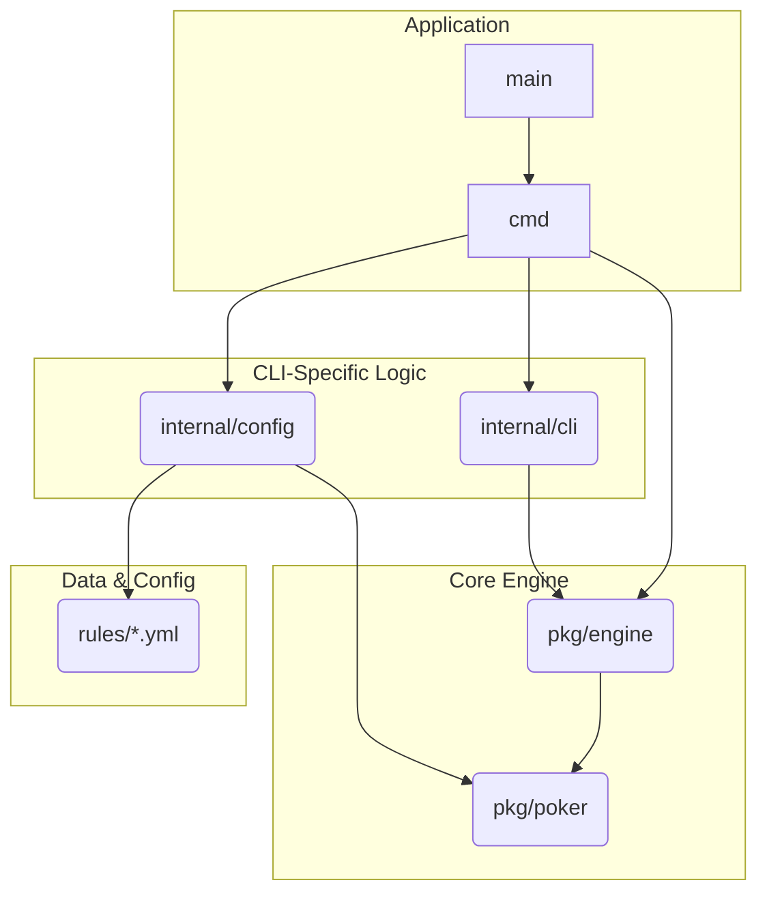

# Application Architecture

This document provides a high-level overview of the `pls7-cli` architecture, its key components, and their interactions.

## High-Level Overview

The application is designed with a clear separation of concerns, consisting of three main parts:

1.  **Poker Library (`pkg/poker`)**: A self-contained, reusable library that encapsulates the core rules, data structures (cards, hands), and evaluation logic of poker. It is completely independent.
2.  **Game Engine (`pkg/engine`)**: A public package that manages the state and flow of a poker game. It consumes `pkg/poker` to enforce rules and orchestrates the game from start to finish, including turn management, betting rounds, and pot distribution.
3.  **CLI Application (`cmd`, `internal`)**: The user-facing part of the project that consumes the game engine. It handles user input, displays game state, and manages the overall application lifecycle.

This decoupled architecture makes the core engine (`pkg/poker` and `pkg/engine`) portable and allows the user interface to be swapped (e.g., to a web UI) with no changes to the underlying game logic.

## Dependency Diagram

The diagram below illustrates the dependency flow between the major packages.

*   **`cmd`** is the central orchestrator, depending on `internal` packages for CLI/config and on `pkg/engine` to run the game.
*   **`pkg/engine`** consumes the **`pkg/poker`** library to manage game flow.
*   **`internal/config`** bridges the `rules/*.yml` data files and the `pkg/poker` library.
*   **`pkg/poker`** is the core, independent library with no project-internal dependencies.

## Package Responsibilities

*   **`rules/` (YAML Files)**
    *   Acts as a "database" for poker rules. Each file defines a variant (NLH, PLS7, etc.) by specifying parameters like hole card count, betting limits, and hand rankings.

*   **`pkg/poker` (The Poker Library)**
    *   **Responsibility**: To be a pure, state-agnostic poker library focused on rules and data models.
    *   It knows how to evaluate hands, what a `Card` or `Deck` is, and how to calculate `Odds`.
    *   Crucially, it defines the `GameRules` struct, which is its "API contract". It operates on any `GameRules` object it receives, making it generic.
    *   It has **zero dependencies** on any other package in the project.

*   **`pkg/engine` (The Game Engine)**
    *   **Responsibility**: To manage the state and flow of a single poker game.
    *   It defines the master `Game` struct, which holds the players, the pot, the current phase, and the `poker.GameRules` for the current game.
    *   It implements the turn-based state machine for a hand (`run.go`), processes player actions, and manages betting rounds.
    *   It uses the `pkg/poker` library for tasks like hand evaluation and rule checks.

*   **`internal/config`**
    *   **Responsibility**: To bridge the `rules/` YAML files and the `pkg/poker` library.
    *   It reads a YAML file (e.g., `rules/pls7.yml`) and unmarshals it into a `poker.GameRules` struct, which is then passed to the `pkg/engine`.

*   **`internal/cli` (The View/Input Layer)**
    *   **Responsibility**: To handle all interaction with the user.
    *   `display.go`: Renders the `engine.Game` state into a human-readable format on the console.
    *   `input.go`: Captures user input and translates it into an `engine.Action` struct.
    *   It is the "skin" of the application and depends on `pkg/engine` for game state data.

*   **`cmd` (The Orchestrator)**
    *   **Responsibility**: To initialize everything and run the main game loop.
    *   It parses command-line flags, uses `internal/config` to load the selected `GameRules`, creates an `engine.Game` instance, and then runs a loop that advances the game turn by turn, calling `internal/cli` and `pkg/engine` functions at each step.

## Key Data Structures & Relationships

*   **`poker.GameRules`**: The blueprint for a poker game. It's a simple data struct loaded from YAML.
*   **`engine.Game`**: The heart of the application. It holds an instance of `poker.GameRules` to know how it should behave. It also contains a slice of `*Player`s, the `Pot`, `CommunityCards`, and the current `GamePhase`.
*   **`engine.Player`**: Represents a participant, holding their `Hand`, `Chips`, and `Status`. CPU players also have an `AIProfile`.
*   **`engine.BettingLimitCalculator`**: This is an interface implemented by `PotLimitCalculator` and `NoLimitCalculator`. The `engine.Game` struct holds an instance of this interface, allowing it to calculate betting limits according to the loaded `GameRules` without needing `if/else` statements for each rule type (Strategy Pattern).

## Execution Flow (A Single Hand)

1.  **Initialization**: `main` calls `cmd.Execute()`. The `runGame` function in `cmd/root.go` is triggered.
2.  **Rule Loading**: `runGame` uses `internal/config` to load the chosen `.yml` file into a `poker.GameRules` struct.
3.  **Game Creation**: An `engine.Game` object is instantiated with the players, initial chip counts, and the loaded `GameRules`.
4.  **Hand Start**: The main loop in `runGame` calls `g.StartNewHand()`. This shuffles the deck, deals cards, and posts blinds.
5.  **Betting Round**: The loop enters a turn-based phase.
    a. It checks `g.IsBettingRoundOver()`.
    b. If not over, it gets the `g.CurrentPlayer()`.
    c. It calls `cli.DisplayGameState()` to show the user the current table (which reads from the `engine.Game` state).
    d. If the player is human, it calls `cli.PromptForAction()` to get input. If CPU, it calls `g.GetCPUAction()`.
    e. The resulting `Action` is sent to `g.ProcessAction()`, which updates the player and game state.
    f. The turn is advanced with `g.AdvanceTurn()`.
6.  **Phase Advance**: Once the betting round is over, `g.Advance()` is called to move to the next phase (e.g., Flop -> Turn), dealing community cards as needed.
7.  **Showdown/Conclusion**: When the hand ends (either by folding or reaching the showdown), `g.DistributePot()` (which uses `poker.EvaluateHand`) is called to determine winners and award chips.
8.  **Next Hand**: The loop waits for user input to start the next hand.
