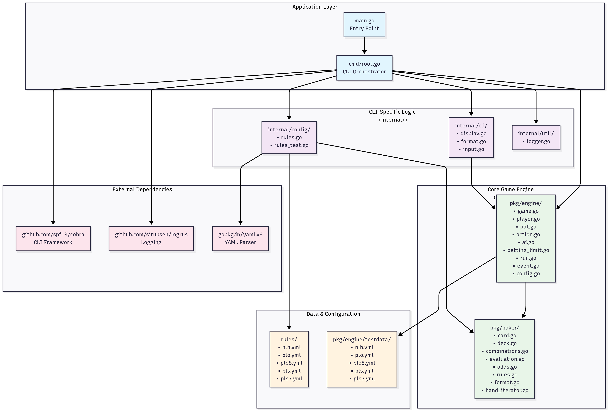

# 애플리케이션 아키텍처

이 문서는 `pls7-cli` 아키텍처, 핵심 구성 요소 및 상호 작용에 대한 개요를 제공합니다.

## 개요

이 애플리케이션은 명확한 관심사 분리 원칙에 따라 설계되었으며, 두 가지 주요 부분으로 구성됩니다.

1.  **포커 엔진 (`pkg/poker`)**: 포커의 규칙과 로직을 캡슐화하는 독립적이고 재사용 가능한 라이브러리입니다. 사용자 인터페이스나 애플리케이션의 메인 흐름에 대해 전혀 알지 못합니다.
2.  **CLI 애플리케이션 (`cmd`, `internal`)**: 포커 엔진을 사용하는 사용자 대면 부분입니다. 사용자 입력을 처리하고, 게임 상태를 표시하며, 전반적인 게임 진행을 관리합니다.

이러한 분리된 아키텍처는 핵심 엔진의 이식성을 높이고, 기본 게임 로직을 최소한으로 변경하면서 사용자 인터페이스를 다른 것(예: 웹 UI)으로 교체할 수 있게 합니다.

## 의존성 다이어그램

아래 다이어그램은 주요 패키지 간의 의존성 흐름을 보여줍니다.

*   **`cmd`**는 모든 `internal` 패키지에 의존하는 중앙 오케스트레이터입니다.
*   **`internal/config`**와 **`internal/game`**은 모두 **`pkg/poker`** 엔진에 의존합니다.
*   **`pkg/poker`**는 내부 의존성이 없는 핵심 독립 엔진입니다.
*   **`rules/`**는 `internal/config`를 통해 엔진을 설정하는 데이터 전용 YAML 파일을 포함합니다.

## 패키지별 책임

*   **`rules/` (YAML 파일)**
    *   포커 규칙의 "데이터베이스" 역할을 합니다. 각 파일은 홀 카드 수, 베팅 한도, 핸드 랭킹과 같은 매개변수를 지정하여 특정 변형(NLH, PLS7 등)을 정의합니다.

*   **`pkg/poker` (엔진)**
    *   **책임**: 상태에 구애받지 않는 순수한 포커 라이브러리가 되는 것.
    *   핸드 평가 방법, `Card` 또는 `Deck`이 무엇인지, `Odds` 계산 방법을 알고 있습니다.
    *   중요하게는, "API 계약"인 `GameRules` 구조체를 정의합니다. 이것은 수신하는 모든 `GameRules` 객체에 대해 작동하므로 일반적입니다.
    *   프로젝트 내 다른 패키지에 대한 **의존성이 전혀 없습니다**.

*   **`internal/config`**
    *   **책임**: `rules/` YAML 파일과 `pkg/poker` 엔진을 연결하는 다리 역할.
    *   YAML 파일(예: `rules/pls7.yml`)을 읽고 `poker.GameRules` 구조체로 변환합니다.

*   **`internal/game` (게임 로직)**
    *   **책임**: 단일 포커 게임의 상태와 흐름을 관리.
    *   플레이어, 팟, 현재 페이즈 및 현재 게임의 `poker.GameRules`를 보유하는 마스터 `Game` 구조체를 정의합니다.
    *   핸드의 턴 기반 상태 머신(`run.go`)을 구현하고, 플레이어 액션을 처리하며, 베팅 라운드를 관리합니다.
    *   핸드 평가와 같은 작업을 위해 `pkg/poker` 엔진을 사용합니다.

*   **`internal/cli` (뷰/입력 계층)**
    *   **책임**: 사용자와의 모든 상호 작용을 처리.
    *   `display.go`: `game.Game` 상태를 콘솔에서 사람이 읽을 수 있는 형식으로 렌더링합니다.
    *   `input.go`: 사용자 입력을 캡처하여 `game.PlayerAction` 구조체로 변환합니다.
    *   애플리케이션의 "스킨"입니다.

*   **`cmd` (오케스트레이터)**
    *   **책임**: 모든 것을 초기화하고 메인 게임 루프를 실행.
    *   명령줄 플래그를 파싱하고, `internal/config`를 사용하여 선택된 `GameRules`를 로드하고, `game.Game` 인스턴스를 생성한 다음, 각 단계에서 `internal/cli` 함수를 호출하여 출력을 표시하고 입력을 받는 턴 기반 루프를 실행합니다.

## 주요 데이터 구조 및 관계

*   **`poker.GameRules`**: 포커 게임의 청사진입니다. YAML에서 로드된 간단한 데이터 구조체입니다.
*   **`game.Game`**: 애플리케이션의 심장입니다. `poker.GameRules` 인스턴스를 보유하여 어떻게 동작해야 하는지 알 수 있습니다. 또한 `*Player` 슬라이스, `Pot`, `CommunityCards` 및 현재 `GamePhase`를 포함합니다.
*   **`game.Player`**: 참가자를 나타내며, 그들의 `Hand`, `Chips`, `Status`를 보유합니다. CPU 플레이어는 `AIProfile`도 가집니다.
*   **`game.BettingLimitCalculator`**: `PotLimitCalculator`와 `NoLimitCalculator`에 의해 구현된 인터페이스입니다. `game.Game` 구조체는 이 인터페이스의 인스턴스를 보유하여, 각 규칙 유형에 대한 `if/else` 문 없이 로드된 `GameRules`에 따라 베팅 한도를 계산할 수 있습니다(전략 패턴).

## 실행 흐름 (단일 핸드)

1.  **초기화**: `main`이 `cmd.Execute()`를 호출합니다. `cmd/root.go`의 `runGame` 함수가 트리거됩니다.
2.  **규칙 로딩**: `runGame`은 `internal/config`를 사용하여 선택된 `.yml` 파일을 `poker.GameRules` 구조체로 로드합니다.
3.  **게임 생성**: `game.Game` 객체가 플레이어, 초기 칩 수, 로드된 `GameRules`로 인스턴스화됩니다.
4.  **핸드 시작**: `runGame`의 메인 루프가 `g.StartNewHand()`를 호출합니다. 이는 덱을 섞고, 카드를 나누어주며, 블라인드를 겁니다.
5.  **베팅 라운드**: 루프는 턴 기반 단계로 들어갑니다.
    a. `g.IsBettingRoundOver()`를 확인합니다.
    b. 끝나지 않았다면, `g.CurrentPlayer()`를 가져옵니다.
    c. `cli.DisplayGameState()`를 호출하여 사용자에게 현재 테이블을 보여줍니다.
    d. 플레이어가 사람이면 `cli.PromptForAction()`을 호출하여 입력을 받고, CPU이면 `g.GetCPUAction()`을 호출합니다.
    e. 결과 `PlayerAction`은 `g.ProcessAction()`으로 전송되어 플레이어와 게임 상태를 업데이트합니다.
    f. `g.AdvanceTurn()`으로 턴이 진행됩니다.
6.  **페이즈 진행**: 베팅 라운드가 끝나면, `g.Advance()`가 호출되어 다음 페이즈(예: 플랍 -> 턴)로 이동하고 필요에 따라 커뮤니티 카드를 분배합니다.
7.  **쇼다운/결론**: 핸드가 끝나면(폴드 또는 쇼다운 도달), `g.DistributePot()`(`poker.EvaluateHand` 사용)이 호출되어 승자를 결정하고 칩을 수여합니다.
8.  **다음 핸드**: 루프는 다음 핸드를 시작하기 위해 사용자 입력을 기다립니다.
